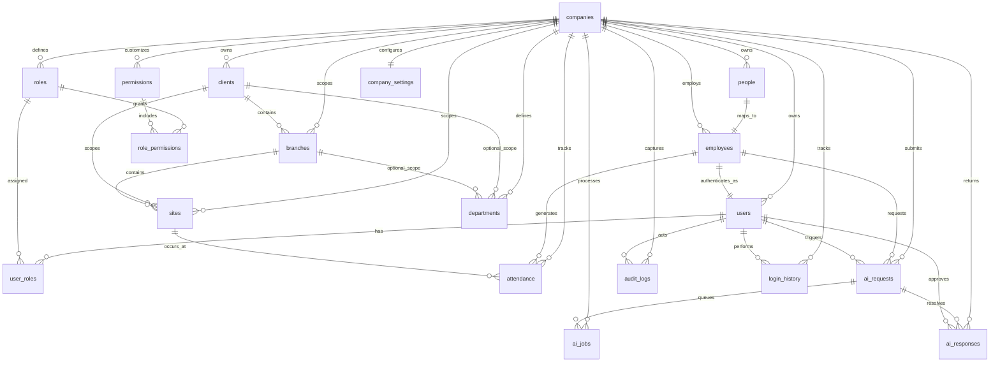

# Sentinel V1 Identity & Access ERD

```mermaid
erDiagram
    companies ||--o{ clients : owns
    companies ||--o{ branches : scopes
    clients ||--o{ branches : contains
    companies ||--o{ sites : scopes
    clients ||--o{ sites : scopes
    branches ||--o{ sites : contains

    companies ||--o{ people : owns
    people ||--|| employees : maps_to
    companies ||--o{ employees : employs

    companies ||--o{ users : owns
    employees ||--|| users : authenticates_as

    companies ||--o{ roles : defines
    companies ||--o{ permissions : customizes
    users ||--o{ user_roles : has
    roles ||--o{ user_roles : assigned

    roles ||--o{ role_permissions : grants
    permissions ||--o{ role_permissions : includes

    companies ||--o{ departments : defines
    clients ||--o{ departments : optional_scope
    branches ||--o{ departments : optional_scope

    companies ||--o{ attendance : tracks
    employees ||--o{ attendance : generates
    sites ||--o{ attendance : occurs_at

    companies ||--|| company_settings : configures

    companies ||--o{ ai_requests : submits
    employees ||--o{ ai_requests : requests
    users ||--o{ ai_requests : triggers

    companies ||--o{ ai_jobs : processes
    ai_requests ||--o{ ai_jobs : queues

    companies ||--o{ ai_responses : returns
    ai_requests ||--o{ ai_responses : resolves
    users ||--o{ ai_responses : approves

    companies ||--o{ audit_logs : captures
    users ||--o{ audit_logs : acts

    companies ||--o{ login_history : tracks
    users ||--o{ login_history : performs
```
